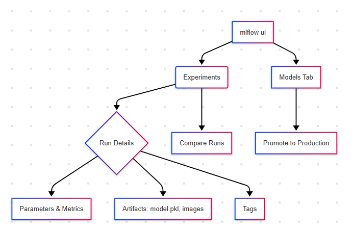

# MLflow Mini Project: Iris Model End-to-End

This project demonstrates an **end-to-end ML lifecycle using MLflow**, from training and tracking to registry and serving via API.

---

## What is MLflow?

**MLflow** is an open-source platform to manage the ML lifecycle, including:
- **Experiment Tracking**: log parameters, metrics, and artifacts
- **Model Registry**: register and promote model versions
- **Deployment**: serve models via API (locally or remotely)
- **Reproducibility**: track code, version, and environment

---

## Project Structure

```
mlflow-mini-project/
│
├── mlruns/                 ← Auto-generated by MLflow to store runs
├── models/                 ← Exported models (optional if using registry only)
│
├── src/
│   ├── train.py            ← Train model, log to MLflow, register to registry
│   ├── serve.py            ← Serve model from registry with FastAPI
│   └── utils.py            ← Utility functions (e.g. validation)
│
├── test/
│   └── test_api.py         ← Unit tests for FastAPI endpoints
│
├── requirements.txt        ← Python dependencies
└── README.md               ← This file!
```

---

## Project Workflow



1. **Train Model** → `src/train.py`
2. **MLflow Tracking** → Log metrics, params, model
3. **Register to Registry** → Promote to `Production`
4. **Serve Model via API** → `src/serve.py` using FastAPI
5. **Test & Deploy** → Use `pytest` to test endpoints

---

## 🧾 Logging to MLflow

```python
with mlflow.start_run():
    mlflow.log_param("n_estimators", 100)
    mlflow.log_param("max_depth", 3)
    mlflow.log_metric("accuracy", 0.95)
    mlflow.sklearn.log_model(model, "model")
```

> The model and metadata will appear in your local MLflow folder (`mlruns/`)

---

## Using MLflow UI

Run this in your terminal:

```bash
mlflow ui
```

Open in browser: [http://localhost:5000](http://localhost:5000)

### MLflow UI Tabs

| Tab        | Purpose                                           |
|------------|---------------------------------------------------|
| **Experiments** | View runs, compare metrics, filter by tags    |
| **Models**      | Registry tab – promote, archive, view versions |
| **Run Details** | View logged metrics, artifacts, and source run |

### MLflow UI Workflow Diagram


---

## API Testing

Tested with `pytest` and `TestClient` from FastAPI:

```bash
pytest -v test/
```

Includes:
- `GET /` health check
- `POST /predict` with valid and invalid inputs

---

## Skills Demonstrated

| Area | Details |
|------|---------|
| MLOps | MLflow Tracking, Model Registry, Versioning |
| ML   | Model training with `sklearn` (RandomForest) |
| Backend | FastAPI for serving, Pydantic validation |
| Testing | `pytest`, `TestClient`, input validation |
| Deployment Ready | Local serving via FastAPI + MLflow Registry |

---

## What I Learned

- How to track and version models using MLflow
- How to register and promote models in MLflow Registry
- How to serve a production-ready ML model using FastAPI
- Importance of experiment reproducibility and testing

---
## Project Author

| Name           | Contact Information                                                  |
|----------------|----------------------------------------------------------------------|
| **Surakiat P.** |                                                                      |
| 📧 Email       | [surakiat.0723@gmail.com](mailto:surakiat.0723@gmail.com)   |
| 🔗 LinkedIn    | [linkedin.com/in/surakiat](https://www.linkedin.com/in/surakiat-kansa-ard-171942351/)     |
| 🌐 GitHub      | [github.com/SurakiatP](https://github.com/SurakiatP)                 |